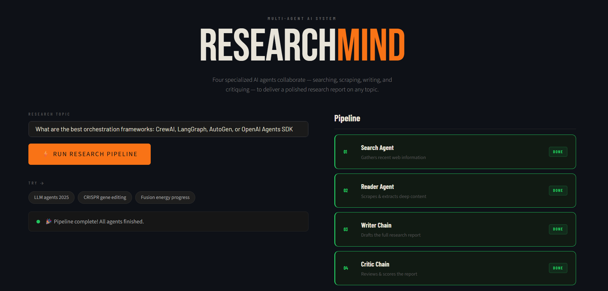
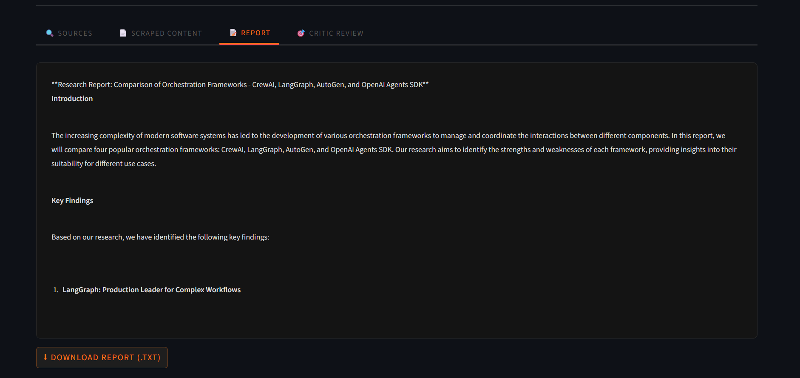
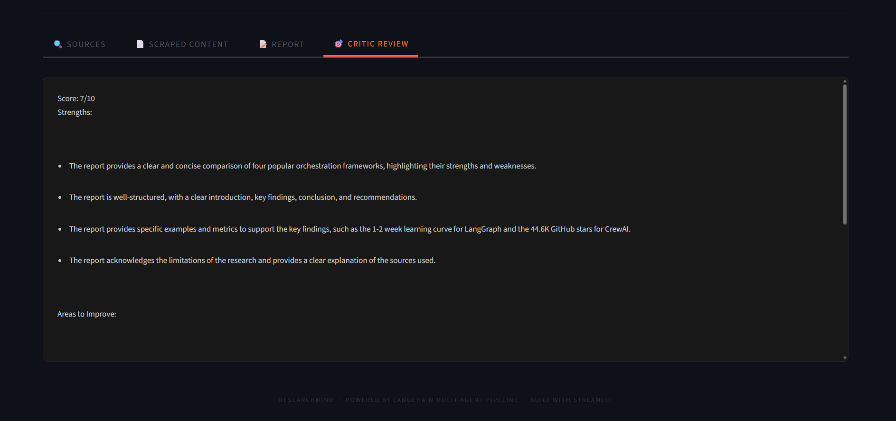

# 🤖 Agentic AI Research Platform

 Autonomous multi-agent AI research system powered by LangGraph, Groq LLM, and Tavily Search API.
 This system automates the entire research workflow — from searching information to generating structured reports and critical evaluation.

🚀 **Live Demo:** https://multi-agent-ai-riya-app.streamlit.app/

<p align="center">
  
  
  
  
  
  
</p>

---

# 🚀 Overview

Agentic AI Research Platform is a powerful multi-agent AI system that automates the complete research workflow using autonomous AI agents.

The platform can:

- Search real-time information from the web
- Extract and process content
- Generate structured research reports
- Critically evaluate generated reports
- Coordinate workflows between multiple AI agents

---

# ⚡ Core Features

## 🔍 Search Agent

Uses Tavily API to retrieve recent and relevant information from the web.

---

## 📄 Reader Agent

Scrapes and extracts useful content from URLs using BeautifulSoup.

---

## ✍️ Writer Agent

Generates structured AI-powered research reports including:

- Introduction
- Key Findings
- Technical Analysis
- Conclusion
- References

---

## 🧠 Critic Agent

Evaluates report quality and provides:

- Score out of 10
- Strengths
- Weaknesses
- Suggestions
- Final Verdict

---

# 🖥️ Application Screenshots

## 🏠 Home Page

<p align="center">
  
</p>

---

## 📊 Generated Research Report

<p align="center">
  
</p>

---

## 🧠 Critic Agent Evaluation

<p align="center">
  
</p>

---

# 🛠️ Tech Stack

- Python
- Streamlit
- LangChain
- LangGraph
- Groq API
- Tavily API
- BeautifulSoup
- dotenv

---

# 📂 Project Structure

```text
AGENTIC-AI-RESEARCH-PLATFORM/
│
├── app.py
├── agents.py
├── tools.py
├── pipeline.py
├── requirements.txt
├── README.md
├── .env
├── .gitignore
│
└── screenshots/
    ├── home.png
    ├── report.png
    └── critic.png
```

---

# ⚙️ Installation

## 1️⃣ Clone Repository

```bash
git clone https://github.com/YOUR_USERNAME/agentic-ai-research-platform.git

cd agentic-ai-research-platform
```

---

## 2️⃣ Create Virtual Environment

```bash
python -m venv .venv
```

---

## 3️⃣ Activate Environment

### Windows

```bash
.venv\Scripts\activate
```

### Linux / Mac

```bash
source .venv/bin/activate
```

---

## 4️⃣ Install Dependencies

```bash
pip install -r requirements.txt
```

---

## 5️⃣ Setup Environment Variables

Create a `.env` file:

```env
GROQ_API_KEY=your_groq_api_key

TAVILY_API_KEY=your_tavily_api_key
```

---

# ▶️ Run Application

```bash
streamlit run app.py
```

---

# ☁️ Deployment

## Deploy on Streamlit Cloud

1. Push project to GitHub
2. Open Streamlit Cloud
3. Create New App
4. Select repository
5. Choose:

```text
app.py
```

6. Add secrets:

```env
GROQ_API_KEY=xxxx

TAVILY_API_KEY=xxxx
```

7. Deploy 🚀

---

# 📈 Technical Highlights

- Multi-Agent AI Workflow
- LangGraph Orchestration
- Real-Time Web Search
- AI-Powered Report Generation
- Autonomous AI Evaluation
- Modular Agent Architecture
- Prompt Engineering
- LLM Tool Calling

---

# 💡 Example Research Topics

- Future of Multi-Agent AI Systems
- AI in Software Engineering
- Latest Quantum Computing Research
- AI Agents in Healthcare
- Generative AI Trends

---

# 🔮 Future Improvements

- Agent memory
- Vector database integration
- Multi-source validation
- Async workflows
- PDF export support
- Advanced analytics dashboard

---

# 👩‍💻 Author

## Riya Priyadarsani Sahu

Backend & AI Engineer

Focused on:

- FastAPI
- LangGraph
- Multi-Agent AI Systems
- LLM Engineering
- AI Automation

---

# ⭐ Support

If you like this project, give it a ⭐ on GitHub.
